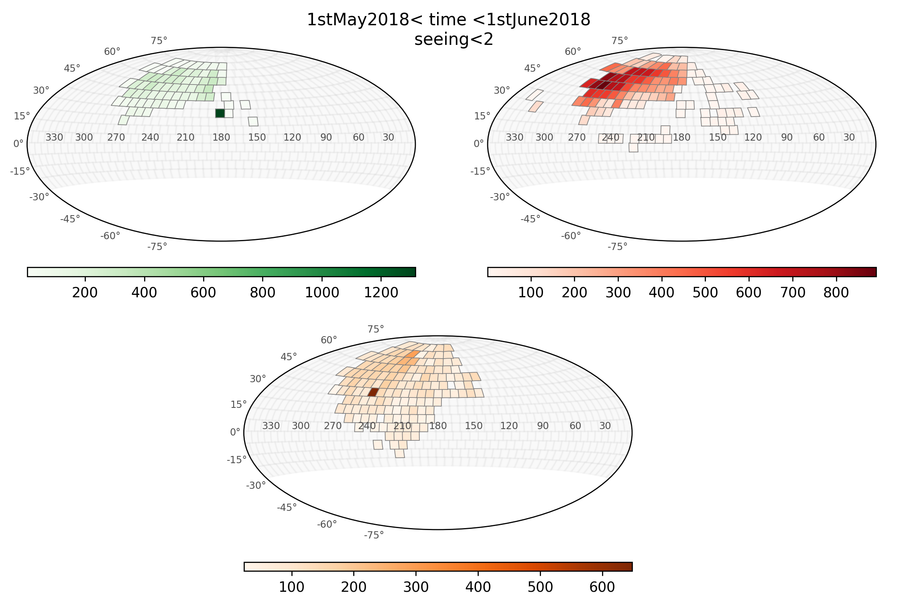

_alpha version: documentation and functionality improving continuously_

# ztfquery
Python wrapper of ZTF IRSA web IPA

_You need to have an IRSA account that has access to ZTF Data to be able to get data using `ztfquery`_


# Installation

go wherever you want to save the folder and then
```
git clone https://github.com/MickaelRigault/ztfquery.git
python setup.py install
```
Then you will need to setup your login and password information:
```
ipython
> import ztfquery
# This will ask you for your login information.
```
The login and password will be stored crypted under ~/.queryirsa. Remove this file to reload it.

You should also create the global variable `$ZTFDATA` (usually in your `~/.bash_profile` or `~/.cshrc`. Data you will download from IRSA will be saved in the directory indicated by `$ZTFDATA` following the IRSA data structure.

# Examples

## Single Day summary
You want to see what ZTF has observed during a given night (say 10th of May 2018, i.e. 20180510):
```python
from ztfquery import query
may1018 = query.NightSummary('20180510')
# The Information concerning the science targets are saved in the attribute `data` 
print(may1018.data)
# The entire information, including the calibration exposure are in `data_all`
```
`data` and `data_all` are Pandas DataFrame.

If you now want to visualize which fields have been observed:
```python
fig = may1018.show_gri_fields(title="Observed Fields \n 2018-05-10")
fig.show()
# Number of g (upper left), r (upper right), I (lower) observations for night 20180510. 
# The grey tile shows the primary ZTF grid for dec>-30deg.
# Remark that particular night, no I band filter observation were made. 
```


## Generic Query

The Generic ZTF data access query uses the `ZTFQuery` object.
Being able to download data requires two steps: 
  1. do the query to know which data are accessible (this uses the `load_metadata()` method.
  2. do the actual download of the accessible data (this uses the `download_data()` method).

Other methods enables you to further see want is going on (like the plotting method `show_gri_fields()`) or check what has already be downloaded and were that is on your computer (`get_local_data()`).

### Example 1 generic SQL, no coordinate in particular.
In this example, we are going to query any thing that have been observed with a *seeing lower than 2arcsec between the 1st of May 2018 and the 1st of June 2018*.
```python
from ztfquery import query
zquery = query.ZTFQuery()
# Check what are the Julian Dates of 1st of May 2018 and 1st of June 2018
from astropy import time
jd_1may18 = time.Time("2018-05-01").jd # 2458239.5
jd_1june18 = time.Time("2018-06-01").jd # 2458270.5
# Do the Query to see what exists
zquery.load_metadata(sql_query="seeing<2 and obsjd BETWEEN 2458239.5 AND 2458270.5") # this will take about 1min

# The information is save as Pandas DataFrame undern `metatable`
zquery.metatable # it contains about 50 000 entries...
# Show the observed fields, limiting it to the main (or primary) grid for visibility (say grid="secondary" to see this rest):
zquery.show_gri_fields(title="1stMay2018< time <1stJune2018 \n seeing<2", grid="main")
# In this figure, the colorbar shows the number of time a given field in in metatable. 
# Remark that each field is made of 16 CCD each divided into 4 quadran, 
# so each single exposure will represent 64 field entries. 
```


### Example 2 position query with filter and time constraints. 

In this second example, we will want to access *the I-band filter (filter #3) observations with 0.01 degree around RA=276.107960 Dec+44.130398 since the 14th of May 2018*.

```python
from ztfquery import query
zquery = query.ZTFQuery()
# Print what are the Julian Dates of 14th of May 2018
from astropy import time
print(time.Time("2018-05-14").jd) # 2458252.5

# Do the Query to see what exists
zquery.load_metadata(radec=[276.107960,+44.130398], size=0.01, sql_query="fid=3 and obsjd>2458252.5") # takes a few seconds
# When writing this README, this had 8 entries:
zquery.metatable
"""
	obsjd	ccdid	filtercode
0	2.458268e+06	1	zi
1	2.458268e+06	15	zi
2	2.458256e+06	15	zi
3	2.458255e+06	1	zi
4	2.458262e+06	1	zi
5	2.458273e+06	1	zi
6	2.458262e+06	15	zi
7	2.458273e+06	15	zi
"""
```

# Access the original `queryIRSA`

The original `queryIRSA.py` code should still be working. It is actually is independent of the rest code and mighht eventually be removed. 

To import `queryIRSA` in your code (for backward compatibility):
```
from ztfquery import queryIRSA
```

# IRSA Web IPA

## MetaData
The metadata structure is detailed here: [ztf_api](https://irsa.ipac.caltech.edu/docs/program_interface/ztf_api.html)
The module `metasearch.py` is build allow the user to download, as pandas `DataFrame` the metadata information associated to the queried Data.

These MetaData can then be used to build the path to the data.

## DataStructure

## Downloading the Data
