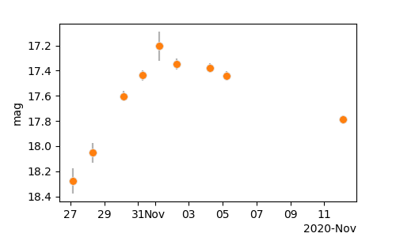

***
_fritz.py documentation_
***

`ztfquery.fritz.py` is module to access data from [fritz.science](https://fritz.science/).

# Requirements 
- You need an account on [fritz.science](https://fritz.science/) and you need to create a token from your [profile](https://fritz.science/profile)
- You need a `ztfquery` version >= 1.12.0

# Structure

With `ztfquery.fritz.py` you can download and store locally **lightcurve**, **spectra**, **alerts**, **sources** and **groups** information. 
For convinience, each of these have a dedicated python object, e.g., `FritzSpectrum`, `FritzGroups` or `FritzPhotometry`.

`ztfquery.fritz.py` has global functions for quick access: 
- For downloading: `download_{}`
- For getting local data: `get_local_{}`


## Downloads
The functions are called `download_{}`:
- `download_lightcurve(source_name, [option])`
- `download_spectra(source_name, [option])`
- `download_alerts(source_name, [option])`
- `download_source(source_name, [option])`
- `download_sources([option])`
- `download_groups([option])`

See the [option] to get details but each should have at least the following:
- `token`: you can directly provide a token. If not, the first time, this will call for you token (see [your profile](https://fritz.science/profile)). I will store it in ~/.ztfquery
- `get_object`: Set that to True to for the dedicated FritzObject implemented in `ztfquery.fritz.py`, if not, this returns the direct download.
- `dirout`: Directory where the data are stored. None means no storing at all and 'default' is the ztfquery default structure (highly recommanded).

## Get Local
Similarly as `download_{}` you can access your local files (already downloaded) using the corresponding `get_local_{}`


# Examples

## LightCurves and Photometry

```python
from ztfquery import fritz
lc = fritz.download_lightcurve("ZTF20acmzoxo", get_object=True)
lc.show()
```


The data downloaded from fritz are store, as pandas.DataFrame as `lc.data`:
```python
print(lc.data.columns)
> Index(['obj_id', 'ra', 'dec', 'filter', 'mjd', 'instrument_id',
       'instrument_name', 'ra_unc', 'dec_unc', 'origin', 'id', 'groups', 'mag',
       'magerr', 'magsys', 'limiting_mag'],
      dtype='object')
```

You can for instance get all the reported coordinates by doing:
```python
lc.get_coordinates(full=True)
> # DataFrame
              ra	dec
    0	331.205290	16.856651
    2	331.205307	16.856643
    4	331.205307	16.856643
    5	331.205293	16.856643
    6	331.205317	16.856641
    ...	...	...
    289	331.205293	16.856636
    290	331.205293	16.856636
    291	331.205295	16.856650
    292	331.205303	16.856639
    293	331.205295	16.856650
```
or get an estimation of the likely extact coordinate by taking a median of that:
```python
lc.get_coordinates(method="nanmedian")
> array([331.2052937,  16.8566374])
```
Finally, you can simply filter the input data using the get_data() method. Say you want the "i" band detected data from 22nd of Oct 2020 to 15th of Nov 2020:
```python
filtereddata = lc.get_data(filters="ztfi", detected=True, time_range=["2020-10-22", "2020-11-15"])
```
You can pass this filtering to the show() method:
```python
from ztfquery import fritz
lc = fritz.download_lightcurve("ZTF20acmzoxo", get_object=True)
lc.show(filtering= dict(filters="ztfi", detected=True, time_range=["2020-10-22", "2020-11-15"]) )
```

