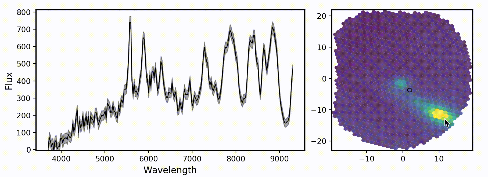

***
_sedm.py documentation_
***

`ztfquery.sedm.py` is module to access sedm data from [pharos](http://pharos.caltech.edu/).
If you do not have an account yet and are ZTF member, send an email to Richard Walters (rsw@astro.caltech.edu) to create one.

# Requirements 
- You need an account on [pharos](http://pharos.caltech.edu/).

*** 


# Getting SEDM data

For example, if you want to download the cube(s) assocated to "ZTF18abqlpgq", simply do:
```python
from ztfquery import sedm
squery = sedm.SEDMQuery()
squery.download_target_data("ZTF18abqlpgq")
```
The data will be stored under `$ZTFDATA+/SEDM/` and each file is under their corresponding observation date (`$ZTFDATA+/SEDM/YYYYMMDD`).

You can then get the full path of the data on your computer.
```python
squery.get_local_data("ZTF18abqlpgq")
```

When `downloading_target_data` or `get_local_data` you can specify which data you want using the `which` argument. (`which='cube'` by default)

For instance if you want the sedm spectra in 'txt' format (as in the marshal):
```python
from ztfquery import sedm
squery = sedm.SEDMQuery()
squery.download_target_data("ZTF18abqlpgq", which='spec', extension='txt')
spec_fullpath = squery.get_local_data("ZTF18abqlpgq", which='spec', extension='txt')
```


# Reading cube and spectra

To read cube and spectra you are invited to use `pysedm` (https://github.com/MickaelRigault/pysedm). 


```python
import pysedm
from ztfquery import sedm
squery = sedm.SEDMQuery()
cube = pysedm.get_sedmcube( squery.get_local_data("ZTF18abqlpgq", which='cube')[0] )
cube.show(interactive=True)
```


See details on [pysedm documentation.](examples/figures/alert_plotter.png)

# Structure

## What Files
The information about which data has been acquired by SEDM every day are _"what files"_. `ztfquery` is downloading the _what files_ and store them inside `$ZTFDATA+/SEDM/whatfiles.json`. Every time you are requesting for data, if the dates is unknown, it is downloaded and `whatfiles.json` is updated. **This is made automatically, don't worry**. 

The first time you are using the `sedm` module, the first query will be a bit slow because you will need to download all the _what files_. Then, it will only download the missing dates, most likely the latest nights depending how often you are using the module. 

### Citation

If you are using a SEDM spectrum obtained since July 2018 (incl.) please cite [the pysedm paper](http://adsabs.harvard.edu/abs/2019arXiv190208526R) 
